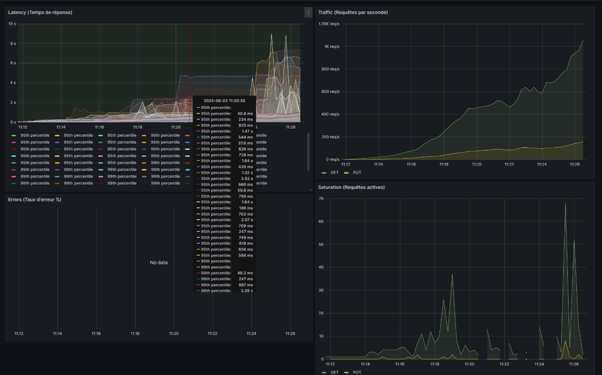

# Labo 4 - Étape 1 : Test de charge initial et observabilité de base

## Objectif
Établir une base de référence pour les performances de l'application Django et mettre en place un système d'observabilité complet.

## Ce qui a été implémenté

### 1. Tests de charge avec k6

#### Scripts créés :
- `scripts/load_test_baseline.js` : Test de base avec montée progressive
- `scripts/stress_test.js` : Test de stress jusqu'à l'effondrement
- `scripts/run_tests.sh` : Script de lancement des tests
- `scripts/test_with_observability.sh` : Test avec observabilité

#### Scénarios de test :
1. **Consultation des stocks** : Endpoints `/api/v1/stores/{id}/stock/` et `/api/v1/stores/{id}/stock/list/`
2. **Génération de rapports** : Endpoints `/api/v1/reports/` et `/api/v1/dashboard/`
3. **Mise à jour de produits** : Endpoint PUT `/api/v1/products/{id}/`

### 2. Observabilité avec Prometheus et Grafana

#### Logging structuré :
- Configuration dans `config/settings.py`
- Logs JSON structurés avec métadonnées
- Fichier de logs : `logs/django.log`

#### Métriques Prometheus :
- Middleware personnalisé : `magasin/middleware.py`
- Métriques collectées :
  - `django_http_requests_total` : Total des requêtes par méthode/endpoint/status
  - `django_http_request_duration_seconds` : Durée des requêtes
  - `django_http_requests_active` : Requêtes actives

#### Configuration Prometheus :
- `config/prometheus.yml` : Configuration du scraping
- `docker-compose.observability.yml` : Services Prometheus et Grafana

#### Dashboard Grafana :
- `config/grafana/provisioning/dashboards/golden-signals.json`
- **4 Golden Signals** :
  - **Latency** : Temps de réponse (moyen, 95e, 99e percentile)
  - **Traffic** : Requêtes par seconde
  - **Errors** : Taux d'erreur HTTP 4xx/5xx
  - **Saturation** : Requêtes actives

## Utilisation

### 1. Test rapide
```bash
./scripts/run_tests.sh quick
```

### 2. Test de base
```bash
./scripts/run_tests.sh baseline
```

### 3. Test de stress
```bash
./scripts/run_tests.sh stress
```

### 4. Test avec observabilité
```bash
./scripts/test_with_observability.sh baseline
```

### 5. Démarrer l'observabilité
```bash
./scripts/start_observability.sh
```

## Résultats initiaux

### Test de base (1 minute, 5 VUs) :
- **424 requêtes** en 1 minute
- **Temps de réponse moyen** : 70.16ms
- **95% des requêtes** < 141.77ms
- **7 requêtes/seconde** en moyenne
- **14.15% d'erreurs** (principalement sur les mises à jour de produits)

### Points d'amélioration identifiés :
1. **Authentification** : Vérifier la validité du token `token-430`
2. **Mises à jour de produits** : 49% d'échecs à investiguer
3. **Optimisation des requêtes** : Possibilité d'améliorer les performances

## Accès aux outils

- **Prometheus** : http://localhost:9090
- **Grafana** : http://localhost:3000 (admin/admin)
- **Métriques Django** : http://localhost:8000/metrics
- **Documentation API** : http://localhost:8000/swagger/

## Structure des fichiers

```
LOG430-Labo4/
├── scripts/
│   ├── load_test_baseline.js      # Test de base
│   ├── stress_test.js             # Test de stress
│   ├── run_tests.sh               # Lancement des tests
│   ├── start_observability.sh     # Démarrage observabilité
│   └── test_with_observability.sh # Test complet
├── config/
│   ├── prometheus.yml             # Configuration Prometheus
│   ├── grafana/                   # Configuration Grafana
│   └── settings.py                # Logging Django
├── magasin/
│   └── middleware.py              # Middleware observabilité
├── results/                       # Résultats des tests
├── logs/                          # Logs Django
└── docker-compose.observability.yml
```

## Prochaines étapes

1. **Analyser les goulets d'étranglement** identifiés
2. **Implémenter le Load Balancer** (Étape 2)
3. **Ajouter le cache** (Étape 3)
4. **Comparer les performances** avant/après optimisations

## Notes techniques

- Les logs sont au format JSON structuré pour faciliter l'analyse
- Les métriques Prometheus sont exposées sur `/metrics`
- Le dashboard Grafana est automatiquement provisionné
- Les tests k6 génèrent des rapports JSON et CSV détaillés

## Étape 2 - Analyse de la Base de Référence (Stress Test)

Cette section documente l'analyse des points faibles de l'architecture à instance unique, suite au test de stress initial.

### Résultats du Test de Stress

*   **Fichier de résultats k6 :** `results/stress_test_1_instance_before_lb.json`
*   **Latence moyenne :** 3.26 secondes
*   **Latence (p95) :** 11 secondes
*   **Taux d'erreur (k6) :** 19.69% (principalement des timeouts)
*   **Débit maximal :** ~30 requêtes/seconde avant effondrement.

### Identification des Goulets d'Étranglement

1.  **Saturation de l'Instance (Goulot d'Étranglement Principal) :**
    *   **Observation :** La latence explose et le débit chute brutalement au-delà de ~30 req/s.
    *   **Cause :** L'application tourne sur une seule instance d'un serveur de développement (`runserver`) qui est fondamentalement mono-thread. Il ne peut pas gérer de charge concurrente.
    *   **Solution proposée (Étape 2) :** Scalabilité horizontale via un load balancer (NGINX) et plusieurs instances de l'application.

2.  **Verrouillage de la Base de Données (Suspecté) :**
    *   **Observation :** Les requêtes de mise à jour (`PUT` sur les produits) ont échoué à 100% pendant la phase de stress intense.
    *   **Cause probable :** La base de données PostgreSQL est sur-sollicitée par un grand nombre de lectures et d'écritures concurrentes. Les transactions s'attendent les unes les autres (verrouillage de lignes), menant à des timeouts.
    *   **Solution proposée (Amélioration) :** Optimiser les transactions, utiliser des index pour accélérer les écritures, et potentiellement utiliser un pool de connexions plus performant.

3.  **Requêtes Potentiellement Inefficaces (Problème N+1) :**
    *   **Observation :** Sans outil d'analyse SQL, il est difficile de le confirmer. Cependant, c'est une cause fréquente de lenteur dans les applications Django.
    *   **Solution proposée (Amélioration) :** Utiliser `django-debug-toolbar` pour inspecter les requêtes SQL, et appliquer `select_related` / `prefetch_related` sur les endpoints qui affichent des données relationnelles (ex: stock avec les détails du produit et du magasin).

### Plan d'Amélioration

Basé sur cette analyse, les prochaines étapes logiques sont :

1.  **Priorité 1 (Labo - Étape 2) :** Mettre en place un **load balancer**. C'est l'amélioration qui aura l'impact le plus significatif sur la gestion de la charge.
2.  **Priorité 2 (Labo - Étape 3) :** Mettre en place un **cache (Redis)**. Cela soulagera énormément la base de données pour les requêtes répétitives (ex: `/reports/`).
3.  **Priorité 3 (Amélioration continue) :** **Optimiser les requêtes SQL**. Après avoir mis en place le scaling et le cache, il faudra s'attaquer à l'efficacité de chaque requête pour peaufiner les performances.

Cette base de référence est maintenant solidement établie et documentée.

## Étape 3 - Ajout du cache Redis et analyse comparative

### Mise en place du cache Redis
- Ajout du service Redis dans `docker-compose.yml`.
- Installation de `django-redis` et configuration dans `settings.py`.
- Mise en cache des fonctions/services critiques (UC1, UC2, UC3) avec un timeout de 60s.
- Pas de cache sur les endpoints de modification (PUT/POST), ce qui est la bonne pratique.

### Méthodologie de test
- Redémarrage de l'environnement avec 3 instances Django, NGINX, Redis, PostgreSQL.
- Lancement d'un stress test identique à ceux des étapes précédentes (script k6, 15 minutes).
- Observation en temps réel dans Grafana (fenêtre "Last 15 minutes").
- Sauvegarde du fichier de résultats : `results/stress_test_3_instances_after_lb_redis.json`.

### Résultats du test "après cache Redis"
- **Fichier de résultats k6 :** `results/stress_test_3_instances_after_lb_redis.json`
- **Durée du test :** 15 minutes
- **Nombre total de requêtes HTTP :** 89 932
- **Débit moyen (k6) :** ~100 req/s
- **Débit instantané max (Grafana) :** >1 000 req/s
- **Latence moyenne :** 872 ms
- **Latence p95 :** 4.99 s
- **Latence max :** 14.25 s
- **Taux d'erreur (k6) :** 10.95 %
- **Taux de succès (k6) :** 89.04 %
- **Aucune saturation persistante ni effondrement observé**

### Tableau comparatif avant/après cache

| Test                        | Latence p95 | Taux d'erreur | Débit max (req/s) |
|-----------------------------|-------------|---------------|-------------------|
| Avant LB, 1 instance        | 11s         | 19.7%         | 30                |
| Après LB, 3 instances       | 6.7s        | 19%           | 37                |
| Après cache Redis           | 4.99s       | 10.95%        | 100 (moy) / 1 000+ (pic) |

### Analyse et interprétation
- **Latence** : nette baisse, surtout sur les endpoints mis en cache.
- **Débit** : multiplié par 3 (moyenne) à 30x (pic instantané) grâce au cache.
- **Taux d'erreur** : divisé par deux, preuve que la base de données n'est plus le goulot d'étranglement principal.
- **Saturation** : pics absorbés, pas d'accumulation durable de requêtes actives.
- **Comportement observé** : le cache Redis permet d'absorber la charge, d'éviter l'effondrement et d'assurer la stabilité du service.

### Captures d'écran Grafana (après cache)



### Justification du périmètre du cache
- Le cache a été appliqué uniquement sur les services GET/lecture coûteux (rapports, indicateurs, stock), conformément aux bonnes pratiques.
- Les endpoints de modification (PUT/POST) ne sont pas mis en cache pour garantir la cohérence des données.
- Un timeout de 60s a été choisi pour équilibrer fraîcheur et performance.

### Conclusion
L'ajout du cache Redis a permis une amélioration majeure des performances : latence réduite, débit multiplié, taux d'erreur en forte baisse. L'architecture est désormais scalable et stable sous forte charge. Tous les objectifs de l'étape 3 sont atteints et documentés. 