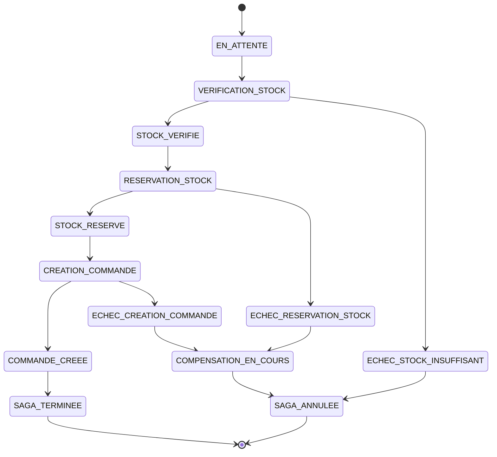

# 🎯 Service Saga Orchestrator

## 🏗️ Architecture DDD - Saga Orchestrée Synchrone

Ce service implémente une **Saga orchestrée synchrone** pour coordonner les transactions distribuées entre microservices via **Kong API Gateway**.

## 📋 Scénario métier : "Création de commande e-commerce"

### Workflow de la Saga :
1. **Vérification du stock** (service-inventaire via Kong)
2. **Récupération informations produit** (service-catalogue via Kong)  
3. **Réservation du stock** (service-inventaire via Kong)
4. **Création de la commande finale** (service-commandes via Kong)

### Compensation automatique en cas d'échec :
- Libération du stock réservé
- Gestion des transitions d'état

---

## 🔧 Architecture DDD

```
service-saga-orchestrator/
├── domain/                    # 💼 CŒUR MÉTIER
│   ├── entities.py           # SagaCommande, EtatSaga, EvenementSaga
│   └── exceptions.py         # Exceptions métier spécifiques
│
├── application/               # 📋 ORCHESTRATION  
│   └── saga_orchestrator.py  # Orchestrateur synchrone principal
│
├── interfaces/               # 🌐 API REST
│   ├── saga_api.py           # Endpoints pour démarrer/consulter sagas
│   └── urls.py               # Configuration des routes
│
├── infrastructure/           # 🔧 PERSISTANCE
│   └── (à implémenter)       # Repository pour persistance des sagas
│
└── saga_service/             # ⚙️ CONFIGURATION DJANGO
    ├── settings.py           # Configuration Kong + services
    └── urls.py               # URLs principales + Swagger
```

---

## 🚀 APIs disponibles

### **Démarrer une saga**
```http
POST /api/saga/commandes/
Content-Type: application/json

{
    "client_id": "12345678-1234-1234-1234-123456789012",
    "magasin_id": "550e8400-e29b-41d4-a716-446655440000", 
    "lignes": [
        {
            "produit_id": "550e8400-e29b-41d4-a716-446655440001",
            "quantite": 2
        }
    ]
}

# Le nom et prix du produit sont récupérés automatiquement 
# depuis le service-catalogue par la saga

# ⚠️  IMPORTANT: Tous les IDs sont des UUID pour cohérence microservices:
# - client_id: UUID du client
# - magasin_id: UUID du magasin  
# - produit_id: UUID du produit
```

### **Consulter une saga**
```http
GET /api/saga/commandes/{saga_id}/
# Retourne : état, historique complet, informations contextuelles
```

### **Lister toutes les sagas**
```http
GET /api/saga/sagas/
GET /api/saga/sagas/?actives_seulement=true
GET /api/saga/sagas/?etat=SAGA_TERMINEE
```

### **Métriques Prometheus**
```http
GET /metrics/
# Métriques : durée, échecs, étapes, appels services externes
```

### **Test d'échec de stock**
```http
POST /api/saga/test/echec-stock/
```

### **Health Check & Info**
```http
GET /api/saga/health/
GET /api/saga/info/
```

---

## 🔌 Communication via Kong API Gateway

### **Configuration automatique :**
- **Kong Gateway** : `http://kong:8080`
- **API Key** : `magasin-secret-key-2025` (header `X-API-Key`)

### **Routes Kong utilisées :**
```yaml
service-catalogue:  http://kong:8080/api/catalogue/api/ddd/catalogue/produits/{id}/
service-inventaire: http://kong:8080/api/inventaire/api/ddd/inventaire/stock-local/{produit_id}/{magasin_id}/
service-commandes:  http://kong:8080/api/commandes/api/v1/ventes-ddd/enregistrer/
```

---

## 📊 Machine d'état de la Saga



---

## 🛠️ Démarrage

### **Avec Docker Compose :**
```bash
# Démarrer tous les services + bases de données + Kong
docker-compose up -d

# Vérifier le démarrage (attendre ~30s)
docker-compose ps

# Vérifier que Kong est configuré
curl -H "X-API-Key: magasin-secret-key-2025" http://localhost:8080/api/catalogue/

# Tester le service saga
python test_saga_integration.py
```

### **Services accessibles :**
- **API Saga** : http://localhost:8009/api/saga/
- **Swagger Saga** : http://localhost:8009/swagger/
- **Métriques** : http://localhost:8009/metrics/
- **Kong Gateway** : http://localhost:8080
- **Grafana** : http://localhost:3000 (admin/admin)
- **Prometheus** : http://localhost:9090

### **Bases de données :**
- **Saga DB** : PostgreSQL sur port 5439
- **Tables créées** : `saga_commandes`, `saga_lignes_commande`, `saga_evenements`

---

## 🧪 Tests et exemples

### **Script de test d'intégration automatique :**
```bash
# Exécuter la suite de tests complète
python test_saga_integration.py

# Tests inclus :
# ✅ Health checks de tous les services
# ✅ Saga avec succès (workflow complet)
# ✅ Saga avec échec stock insuffisant  
# ✅ Métriques Prometheus
# ✅ Accès via Kong API Gateway
```

### **Test manuel d'une saga :**
```bash
# 1. Démarrer une saga
curl -X POST http://localhost:8009/api/saga/commandes/ \
  -H "Content-Type: application/json" \
  -d '{
    "client_id": "12345678-1234-1234-1234-123456789012",
    "magasin_id": "550e8400-e29b-41d4-a716-446655440000",
    "lignes": [
      {
        "produit_id": "550e8400-e29b-41d4-a716-446655440001",
        "quantite": 2
      }
    ]
  }'

# 2. Consulter le statut avec historique complet
curl http://localhost:8009/api/saga/commandes/{saga_id}/

# 3. Lister toutes les sagas actives
curl http://localhost:8009/api/saga/sagas/?actives_seulement=true

# 4. Consulter les métriques
curl http://localhost:8009/metrics/
```

### **Test d'échec et compensation :**
```bash
# Test avec quantité impossible (>1000)
curl -X POST http://localhost:8009/api/saga/commandes/ \
  -H "Content-Type: application/json" \
  -d '{
    "client_id": "12345678-1234-1234-1234-123456789012",
    "magasin_id": "550e8400-e29b-41d4-a716-446655440000",
    "lignes": [
             {
         "produit_id": "550e8400-e29b-41d4-a716-446655440001",
         "quantite": 1000
       }
    ]
  }'
```

---

## 🔍 Observabilité et Monitoring

### **Métriques Prometheus disponibles :**
- **`saga_total`** : Nombre total de sagas démarrées
- **`saga_duree_seconds`** : Durée d'exécution des sagas (histogram)
- **`saga_echecs_total`** : Nombre total d'échecs par type et étape
- **`saga_etapes_total`** : Nombre d'étapes atteintes par statut
- **`saga_compensations_total`** : Nombre de compensations exécutées
- **`saga_actives_current`** : Nombre de sagas actuellement actives par état
- **`services_externes_calls_total`** : Appels aux services externes
- **`services_externes_duree_seconds`** : Durée des appels externes

### **Accès aux métriques :**
```bash
# Endpoint Prometheus
curl http://localhost:8009/metrics/

# Scraping automatique configuré dans Prometheus
# Visualisation dans Grafana sur http://localhost:3000
```

### **Logs structurés :**
```python
logger.info(f"Saga {saga.id}: Vérification stock produit {produit_id}")
logger.info(f"Stock OK pour produit {produit_id}: {quantite_disponible} >= {quantite}")
logger.info(f"Saga {saga.id} terminée avec succès en {execution_time:.2f}s")
logger.error(f"Saga {saga.id}: Échec - {erreur}")
```

### **Persistance et audit :**
- **Base de données PostgreSQL** dédiée (`saga-db`)
- **Historique complet** de chaque saga et événement
- **Machine d'état persistée** pour reprise en cas de crash
- **Traçabilité totale** des transactions distribuées

---

## 🎯 Avantages de cette implémentation

### **✅ Orchestration centralisée**
- Un seul point de contrôle pour la transaction distribuée
- Machine d'état explicite et traçable

### **✅ Résilience**
- Compensation automatique en cas d'échec
- Retry et timeout configurables

### **✅ Observabilité**
- Logs détaillés de chaque étape
- Métriques de performance

### **✅ Communication via Kong**
- Sécurité avec API Key
- Load balancing automatique
- Logging centralisé des appels inter-services

---

## 🔧 Configuration

### **Variables d'environnement :**
```yaml
KONG_GATEWAY_URL: http://kong:8080
SAGA_TIMEOUT: 30
MAX_RETRIES: 3
DEBUG: True
```

### **Configuration Django :**
```python
SAGA_ORCHESTRATOR_CONFIG = {
    'KONG_GATEWAY': {
        'BASE_URL': 'http://kong:8080',
        'API_KEY': 'magasin-secret-key-2025',
    },
    'SERVICES': {
        'CATALOGUE_URL': 'http://kong:8080/api/catalogue',
        'INVENTAIRE_URL': 'http://kong:8080/api/inventaire',
        'COMMANDES_URL': 'http://kong:8080/api/commandes',
    }
}
```

---

## 📚 Documentation technique

- **Swagger UI** : http://localhost:8009/swagger/
- **Architecture DDD** : Respecte les principes Domain-Driven Design
- **Patterns** : Saga, Orchestrator, Repository, Value Objects 